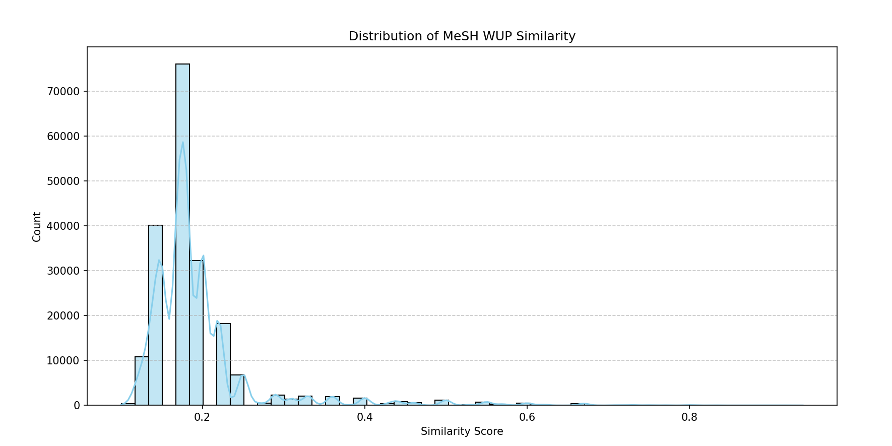

# MeSH 醫學術語相似度資料集
本資料夾主要利用美國國家醫學圖書館（NLM）提供的 MeSH (Medical Subject Headings) 進行資料前處理，整理成可以進行 LoRA 訓練形式的資料集

## 專案目的

主要目標是解析 MeSH 的 'Diseases [C]' 分類下的樹狀結構，並根據節點在樹中的深度計算術語間的 Wu-Palmer 相似度 (WUP Similarity)，最終生成一個包含「術語1」、「術語2」和「相似度」的 CSV 格式數據集。

## 檔案結構與說明
- 可自行調整`download.py`和`create_dataset.py`的資料年份，更換不同年度的MeSH資料，以下皆以2025年度為例。
-   `mesh2025.nt.gz`: MeSH 2025 年版的原始 RDF 資料檔案 (N-Triples 格式，經 gzip 壓縮)。
-   `download.py`: 用於從 NLM 官方 FTP 伺服器下載 `mesh2025.nt.gz` 的腳本。
-   `create_dataset.py`: 核心處理腳本。它會執行以下操作：
    1.  解析 `mesh2025.nt.gz` RDF 檔案。
    2.  從中提取 'Diseases [C]' 分類，並建立一個階層式的樹狀結構。
    3.  從樹中隨機取樣術語配對。
    4.  計算每對術語的 Wu-Palmer 相似度。
    5.  將結果儲存到 `mesh_dataset.csv`。
-   `mesh_dataset.csv`: 由 `create_dataset.py` 生成的最終輸出檔案，包含術語配對和它們的 WUP 相似度分數。
-   `README.md`: 本說明檔案。

## 環境需求

要執行此專案，您需要安裝 Python 3 以及以下函式庫：

-   `rdflib`: 用於解析 RDF 資料。
-   `pandas`: 用於處理資料及輸出 CSV 檔案。

您可以使用 pip 來安裝這些套件：
```bash
pip install rdflib pandas
```

## 使用步驟

1.  **下載 MeSH 資料**

    首先，執行 `download.py` 來下載所需的 MeSH 原始資料。
    ```bash
    cd MeSH_data
    python download.py
    ```
    這將會下載 `mesh2025.nt.gz` 到當前目錄。

2.  **生成數據集**

    下載完成後，執行 `create_dataset.py` 來開始處理資料並生成相似度數據集。
    ```bash
    python create_dataset.py
    ```
    腳本執行時會顯示詳細的處理進度，包括 RDF 解析、樹狀結構建立、取樣過程等。腳本執行完畢後，將會生成 `mesh_dataset.csv` 檔案。

    您可以在 `create_dataset.py` 腳本中修改 `SAMPLING_QUANTITY` 變數來控制想要生成的樣本數量。

## 輸出範例

`mesh_dataset.csv` 檔案內容格式如下：

```csv
word_i,word_j,wup_similarity
Neoplasm,Disease,0.5
Neoplasm,Tumor,1.0
...
```

## Example outputs
``` bash
--- 步驟 1: 解析 RDF 檔案 ---
正在解析 mesh2025.nt.gz...
解析完成。總三元組數: 15349035

--- 步驟 2: 從 RDF 圖譜中提取資料 ---
正在提取 TreeNumber 到 Descriptor 的對應關係...
找到 64972 個唯一的 TreeNumbers 對應到 Descriptors。
  範例 TreeNumber -> Descriptor 對應:
    'D02.355.291.933.125' -> ['http://id.nlm.nih.gov/mesh/2025/D000001']
    'D02.540.576.625.125' -> ['http://id.nlm.nih.gov/mesh/2025/D000001']
    'D03.633.100.221.173' -> ['http://id.nlm.nih.gov/mesh/2025/D000001']

正在提取 Descriptor 到 Term 的對應關係...
  已處理 5000/31030 個 descriptors 的術語提取...
  已處理 10000/31030 個 descriptors 的術語提取...
  已處理 15000/31030 個 descriptors 的術語提取...
  已處理 20000/31030 個 descriptors 的術語提取...
  已處理 25000/31030 個 descriptors 的術語提取...
  已處理 30000/31030 個 descriptors 的術語提取...
完成 descriptors 的處理。
找到 11599 個具有關聯術語的 Descriptors。
  範例 Descriptor -> Terms 對應:
    'http://id.nlm.nih.gov/mesh/2025/D003072' -> ['Overinclusion']...
    'http://id.nlm.nih.gov/mesh/2025/D009693' -> ['Genomic Hybridization']...
    'http://id.nlm.nih.gov/mesh/2025/D003317' -> ['Stromal Dystrophies, Corneal', "Groenouw's Dystrophies", 'Macular Dystrophy, Corneal']...

正在整合 TreeNumber 到 Terms 的對應關係...
已整合 25058 個具有術語的 TreeNumbers。
  範例 TreeNumber -> Terms 對應 (整合後):
    'D02.355.291.933.125' -> ['A-23187']...
    'D02.540.576.625.125' -> ['A-23187']...
    'D03.633.100.221.173' -> ['A-23187']...

--- 步驟 3: 建立 'Diseases [C]' 樹狀結構 ---
找到 5551 個以 'C' 開頭的顯式樹狀編號。
總共需要建立的節點數 (顯式 + 隱式): 6804
根節點 'C' 沒有術語，嘗試從 descriptor D004194 填入。
使用備用術語 'Diseases' 建立 'C' 節點。
正在為所有節點新增 Descriptor 的 rdfs:label (如果存在)...
已為 6803 個節點新增了 Descriptor 的 rdfs:label。
正在檢查並確保所有節點都至少有一個術語 (備用方案)...
已建立 6804 個 MeshNode 物件。
正在將節點連結成樹狀結構並設定深度...
樹狀結構連結完成。
  根節點 'C' 有 22 個直接子節點。

--- 節點資訊：深度為 2 的節點 ---
  - 節點: C01 (深度 2), 子節點數量: 29
  - 節點: C04 (深度 2), 子節點數量: 14
  - 節點: C05 (深度 2), 子節點數量: 10
  - 節點: C06 (深度 2), 子節點數量: 8
  - 節點: C07 (深度 2), 子節點數量: 6
  - 節點: C08 (深度 2), 子節點數量: 13
  - 節點: C09 (深度 2), 子節點數量: 6
  - 節點: C10 (深度 2), 子節點數量: 16
  - 節點: C11 (深度 2), 子節點數量: 22
  - 節點: C12 (深度 2), 子節點數量: 6
  - 節點: C14 (深度 2), 子節點數量: 4
  - 節點: C15 (深度 2), 子節點數量: 2
  - 節點: C16 (深度 2), 子節點數量: 4
  - 節點: C17 (深度 2), 子節點數量: 2
  - 節點: C18 (深度 2), 子節點數量: 2
  - 節點: C19 (深度 2), 子節點數量: 9
  - 節點: C20 (深度 2), 子節點數量: 9
  - 節點: C22 (深度 2), 子節點數量: 10
  - 節點: C23 (深度 2), 子節點數量: 4
  - 節點: C24 (深度 2), 子節點數量: 8
  - 節點: C25 (深度 2), 子節點數量: 3
  - 節點: C26 (深度 2), 子節點數量: 26

--- 步驟 4: 最終樹狀結構摘要 ---
'C' 類別中的總節點數: 6804
'C' 類別中的總唯一術語數: 7271
基於唯一的術語對，理論上最多可產生 26,430,085 個樣本。

--- C21 子樹詳細資訊 (便於檢查) ---
在資料中找不到 C21 節點。

--- 步驟 5: 為 CSV 檔案產生 5000 個樣本 ---
找到 6804 個可用於取樣的節點。
開始取樣過程...
    - Sim('C23.888.592.608.550.550', 'C16.320.565.189.435.825.700')
      - Depth1: 7, Depth2: 8
      - LCS: 'C' (Depth: 1)
      - Similarity: (2 * 1) / (7 + 8) = 0.1333
  - 樣本 #1:
    - Node1: 'C23.888.592.608.550.550' | Term: 'Spastic'
    - Node2: 'C16.320.565.189.435.825.700' | Term: 'Niemann-Pick Diseases'
    - Sim('C06.301.780', 'C16.320.180.019')
      - Depth1: 4, Depth2: 5
      - LCS: 'C' (Depth: 1)
      - Similarity: (2 * 1) / (4 + 5) = 0.2222
  - 樣本 #2:
    - Node1: 'C06.301.780' | Term: 'Peritoneal Neoplasms'
    - Node2: 'C16.320.180.019' | Term: '22q11 Deletion Syndrome'
    - Sim('C18.452.950.340', 'C18.452.648.100.544')
      - Depth1: 5, Depth2: 6
      - LCS: 'C18.452' (Depth: 3)
      - Similarity: (2 * 3) / (5 + 6) = 0.5455
  - 樣本 #3:
    - Node1: 'C18.452.950.340' | Term: 'Milk-Alkali Syndrome'
    - Node2: 'C18.452.648.100.544' | Term: 'Lysine Alpha-Ketoglutarate Reductase Deficiency Disease'
    - Sim('C10.720.475.400.350', 'C16.320.180.440')
      - Depth1: 6, Depth2: 5
      - LCS: 'C' (Depth: 1)
      - Similarity: (2 * 1) / (6 + 5) = 0.1818
  - 樣本 #4:
    - Node1: 'C10.720.475.400.350' | Term: 'Lead Polyneuropathy'
    - Node2: 'C16.320.180.440' | Term: 'Jacobsen Distal 11q Deletion Syndrome'
    - Sim('C04.557.450.795.350', 'C15.378.243.937')
      - Depth1: 6, Depth2: 5
      - LCS: 'C' (Depth: 1)
      - Similarity: (2 * 1) / (6 + 5) = 0.1818
  - 樣本 #5:
    - Node1: 'C04.557.450.795.350' | Term: 'Fibrosarcoma'
    - Node2: 'C15.378.243.937' | Term: 'Thrombocytopenia'
    - Sim('C10.886.425.800.750', 'C08.785.600.693')
      - Depth1: 6, Depth2: 5
      - LCS: 'C' (Depth: 1)
      - Similarity: (2 * 1) / (6 + 5) = 0.1818
  - 樣本 #6:
    - Node1: 'C10.886.425.800.750' | Term: 'Sleep Apnea Syndromes'
    - Node2: 'C08.785.600.693' | Term: 'Paranasal Sinus Neoplasms'
    - Sim('C08.785.600.693', 'C18.654.726.750')
      - Depth1: 5, Depth2: 5
      - LCS: 'C' (Depth: 1)
      - Similarity: (2 * 1) / (5 + 5) = 0.2000
  - 樣本 #7:
    - Node1: 'C08.785.600.693' | Term: 'Paranasal Sinus Neoplasms'
    - Node2: 'C18.654.726.750' | Term: 'Overweight'
    - Sim('C08.785.640', 'C19.391.119.096.750')
      - Depth1: 4, Depth2: 6
      - LCS: 'C' (Depth: 1)
      - Similarity: (2 * 1) / (4 + 6) = 0.2000
  - 樣本 #8:
    - Node1: 'C08.785.640' | Term: 'Pleural Neoplasms'
    - Node2: 'C19.391.119.096.750' | Term: 'Kallmann Syndrome'
    - Sim('C20.111.199', 'C14.280.238.625')
      - Depth1: 4, Depth2: 5
      - LCS: 'C' (Depth: 1)
      - Similarity: (2 * 1) / (4 + 5) = 0.2222
  - 樣本 #9:
    - Node1: 'C20.111.199' | Term: 'Arthritis, Rheumatoid'
    - Node2: 'C14.280.238.625' | Term: 'Myocarditis'
    - Sim('C05.116.214.500.500', 'C10.900.300.218.487')
      - Depth1: 6, Depth2: 6
      - LCS: 'C' (Depth: 1)
      - Similarity: (2 * 1) / (6 + 6) = 0.1667
  - 樣本 #10:
    - Node1: 'C05.116.214.500.500' | Term: 'Developmental Coxa Vara'
    - Node2: 'C10.900.300.218.487' | Term: 'Olfactory Nerve Avulsion'
    - Sim('C19.391.630.705.398', 'C16.131.666.300.780')
      - Depth1: 6, Depth2: 6
      - LCS: 'C' (Depth: 1)
      - Similarity: (2 * 1) / (6 + 6) = 0.1667
  - 樣本 #11:
    - Node1: 'C19.391.630.705.398' | Term: 'Granulosa Cell Cancer'
    - Node2: 'C16.131.666.300.780' | Term: 'Phytanic Acid Oxidase Deficiency'
    - Sim('C16.131.240.850.902', 'C18.452.132.360')
      - Depth1: 6, Depth2: 5
      - LCS: 'C' (Depth: 1)
      - Similarity: (2 * 1) / (6 + 5) = 0.1818
  - 樣本 #12:
    - Node1: 'C16.131.240.850.902' | Term: 'Bilateral Superior Vena Cava'
    - Node2: 'C18.452.132.360' | Term: 'Hepatic Stupor'
    - Sim('C10.597.606.762.200', 'C10.597.613.250')
      - Depth1: 6, Depth2: 5
      - LCS: 'C10.597' (Depth: 3)
      - Similarity: (2 * 3) / (6 + 5) = 0.5455
  - 樣本 #13:
    - Node1: 'C10.597.606.762.200' | Term: 'Auditory Perceptual Disorders'
    - Node2: 'C10.597.613.250' | Term: 'Fasciculation, Benign'
    - Sim('C19.874.482', 'C23.550.073.845.940')
      - Depth1: 4, Depth2: 6
      - LCS: 'C' (Depth: 1)
      - Similarity: (2 * 1) / (4 + 6) = 0.2000
  - 樣本 #14:
    - Node1: 'C19.874.482' | Term: 'Hypothyroidism'
    - Node2: 'C23.550.073.845.940' | Term: 'Nonsustained Ventricular Tachycardia'
    - Sim('C15.378.243.937.925.750', 'C23.888.821.937')
      - Depth1: 7, Depth2: 5
      - LCS: 'C' (Depth: 1)
      - Similarity: (2 * 1) / (7 + 5) = 0.1667
  - 樣本 #15:
    - Node1: 'C15.378.243.937.925.750' | Term: 'Purpura, Thrombocytopenic'
    - Node2: 'C23.888.821.937' | Term: 'Vomiting'
    - Sim('C10.597.305', 'C10.228.228.205.300.500')
      - Depth1: 4, Depth2: 7
      - LCS: 'C10' (Depth: 2)
      - Similarity: (2 * 2) / (4 + 7) = 0.3636
  - 樣本 #16:
    - Node1: 'C10.597.305' | Term: 'Decorticate State'
    - Node2: 'C10.228.228.205.300.500' | Term: 'Malaria Meningitis'
    - Sim('C10.292.562.675', 'C04.557.450.565.590.350.590')
      - Depth1: 5, Depth2: 8
      - LCS: 'C' (Depth: 1)
      - Similarity: (2 * 1) / (5 + 8) = 0.1538
  - 樣本 #17:
    - Node1: 'C10.292.562.675' | Term: 'Convergence Nystagmus'
    - Node2: 'C04.557.450.565.590.350.590' | Term: 'Malignant Peripheral Nerve Sheath Tumors'
    - Sim('C14.240.400', 'C11.941.879')
      - Depth1: 4, Depth2: 4
      - LCS: 'C' (Depth: 1)
      - Similarity: (2 * 1) / (4 + 4) = 0.2500
  - 樣本 #18:
    - Node1: 'C14.240.400' | Term: 'Heart Defects, Congenital'
    - Node2: 'C11.941.879' | Term: 'Uveitis'
    - Sim('C01.150.252.400.260', 'C06.552')
      - Depth1: 6, Depth2: 3
      - LCS: 'C' (Depth: 1)
      - Similarity: (2 * 1) / (6 + 3) = 0.2222
  - 樣本 #19:
    - Node1: 'C01.150.252.400.260' | Term: 'Desulfovibrionaceae Infections'
    - Node2: 'C06.552' | Term: 'Liver Dysfunction'
    - Sim('C10.228.140.163.100.435.825.300.400', 'C16.131.939.316.343')
      - Depth1: 10, Depth2: 6
      - LCS: 'C' (Depth: 1)
      - Similarity: (2 * 1) / (10 + 6) = 0.1250
  - 樣本 #20:
    - Node1: 'C10.228.140.163.100.435.825.300.400' | Term: 'Gangliosidosis, Generalized GM1, Type 2'
    - Node2: 'C16.131.939.316.343' | Term: 'Familial XX True Hermaphroditism'
  已產生 100/5000 個樣本...
  已產生 200/5000 個樣本...
  已產生 300/5000 個樣本...
  已產生 400/5000 個樣本...
  已產生 500/5000 個樣本...
  已產生 600/5000 個樣本...
  已產生 700/5000 個樣本...
  已產生 800/5000 個樣本...
  已產生 900/5000 個樣本...
  已產生 1000/5000 個樣本...
  已產生 1100/5000 個樣本...
  已產生 1200/5000 個樣本...
  已產生 1300/5000 個樣本...
  已產生 1400/5000 個樣本...
  已產生 1500/5000 個樣本...
  已產生 1600/5000 個樣本...
  已產生 1700/5000 個樣本...
  已產生 1800/5000 個樣本...
  已產生 1900/5000 個樣本...
  已產生 2000/5000 個樣本...
  已產生 2100/5000 個樣本...
  已產生 2200/5000 個樣本...
  已產生 2300/5000 個樣本...
  已產生 2400/5000 個樣本...
  已產生 2500/5000 個樣本...
  已產生 2600/5000 個樣本...
  已產生 2700/5000 個樣本...
  已產生 2800/5000 個樣本...
  已產生 2900/5000 個樣本...
  已產生 3000/5000 個樣本...
  已產生 3100/5000 個樣本...
  已產生 3200/5000 個樣本...
  已產生 3300/5000 個樣本...
  已產生 3400/5000 個樣本...
  已產生 3500/5000 個樣本...
  已產生 3600/5000 個樣本...
  已產生 3700/5000 個樣本...
  已產生 3800/5000 個樣本...
  已產生 3900/5000 個樣本...
  已產生 4000/5000 個樣本...
  已產生 4100/5000 個樣本...
  已產生 4200/5000 個樣本...
  已產生 4300/5000 個樣本...
  已產生 4400/5000 個樣本...
  已產生 4500/5000 個樣本...
  已產生 4600/5000 個樣本...
  已產生 4700/5000 個樣本...
  已產生 4800/5000 個樣本...
  已產生 4900/5000 個樣本...
  已產生 5000/5000 個樣本...
取樣完成。

--- 步驟 6: 輸出 ---
已產生 5000 個樣本並儲存至 mesh_dataset.csv
輸出檔案的前 5 列:
                 word_i                                             word_j  wup_similarity
0               Spastic                              Niemann-Pick Diseases            0.13
1  Peritoneal Neoplasms
```
## 探索性資料分析 (EDA)
### 相似度分佈 (Label Distribution)
下圖顯示了資料集中相似度分佈。
此圖僅以descriptor主要label為隨機挑選節點目標，總樣本數200000

