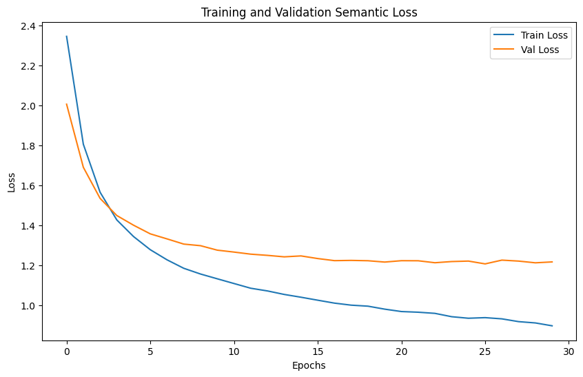

```
訓練時間: 7082.26 秒

--- Final Evaluation Report ---
              precision    recall  f1-score   support

           0       0.88      0.64      0.74        22
           1       0.33      0.50      0.40         8
           2       1.00      0.80      0.89         5
           3       0.80      0.82      0.81       103
           4       0.63      0.55      0.59        22
           5       0.65      0.74      0.69        35
           6       0.60      0.50      0.55         6
           7       0.52      0.56      0.54        25
           8       1.00      0.50      0.67         6
           9       0.54      0.66      0.59        56
          10       0.69      0.92      0.79        12
          11       0.77      0.68      0.72        34
          12       0.81      0.65      0.72        20
          13       0.70      0.86      0.78       118
          14       0.50      0.38      0.43        13
          15       0.14      0.08      0.10        13
          16       0.62      0.65      0.64        23
          17       0.61      0.53      0.57        32
          18       0.33      0.22      0.27         9
          19       0.50      0.54      0.52        41
          20       0.73      0.75      0.74        55
          21       0.00      0.00      0.00         2
          22       0.50      0.36      0.42        80

    accuracy                           0.65       740
   macro avg       0.60      0.56      0.57       740
weighted avg       0.65      0.65      0.64       740

```

