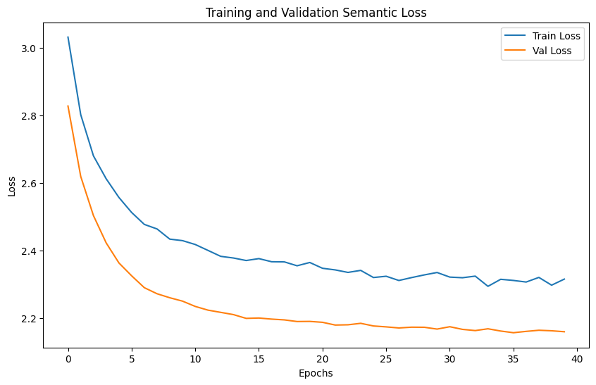
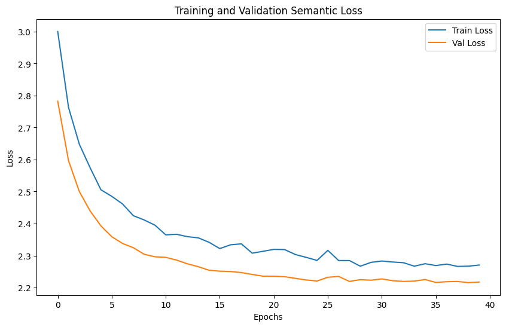
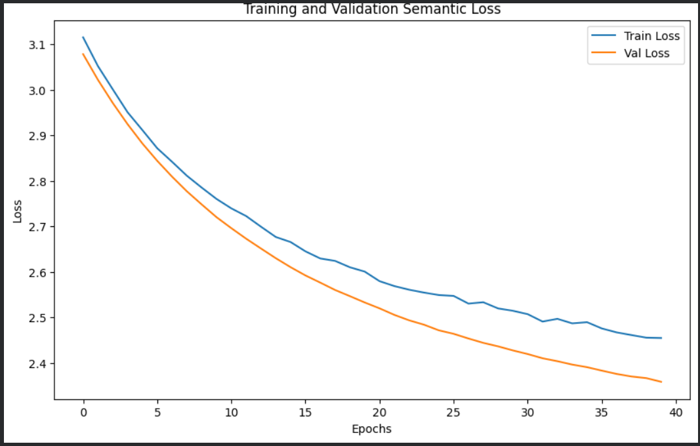

# Model
- 這個資料夾用來存放實際訓練的 CoLab 檔案
- 比較三種不同模式下的模型下游分類任務表現(basic/with MLM/LoRA with MeSH)

## Training/Testing data config
- 資料筆數、切割方法、seedNum、filter 等前處理設定
- 3種比較方法的分類器皆須使用相同資料集
- MLM Training/classifier Training/classifier testing

## NN classifier
- 模型頂層的分類器，訓練參數和方法都要相同
- 23種下游分類類別

## TODO
- [x] RoBERTa basic model 直接做下游分類任務
- [x] RoBERTa basic model + Training Data 做MLM學習後再做下游分類任務
- [x] RoBERTa basic model + LoRA(Mesh) 後再做下游分類任務

## 0202 result (MLM、LoRA)
### LoRA with 100000 data

```
--- Final Evaluation Report ---
              precision    recall  f1-score   support

           0       0.19      0.19      0.19        42
           1       0.44      0.60      0.51        43
           2       0.47      0.63      0.54        43
           3       0.29      0.40      0.33        43
           4       0.27      0.30      0.29        43
           5       0.36      0.37      0.36        43
           6       0.46      0.42      0.44        43
           7       0.36      0.30      0.33        43
           8       0.47      0.55      0.51        42
           9       0.47      0.33      0.39        42
          10       0.46      0.40      0.42        43
          11       0.32      0.35      0.33        43
          12       0.44      0.40      0.42        42
          13       0.36      0.56      0.44        43
          14       0.32      0.35      0.33        43
          15       0.43      0.31      0.36        42
          16       0.33      0.26      0.29        43
          17       0.44      0.67      0.53        42
          18       0.48      0.47      0.47        43
          19       0.23      0.21      0.22        43
          20       0.42      0.40      0.41        43
          21       0.30      0.23      0.26        43
          22       0.00      0.00      0.00        43

    accuracy                           0.38       983
   macro avg       0.36      0.38      0.36       983
weighted avg       0.36      0.38      0.36       983
```
### LoRA with 200000 data

```
--- Final Evaluation Report ---
              precision    recall  f1-score   support

           0       0.17      0.10      0.12        42
           1       0.40      0.58      0.47        43
           2       0.47      0.53      0.50        43
           3       0.24      0.42      0.31        43
           4       0.37      0.47      0.41        43
           5       0.41      0.37      0.39        43
           6       0.50      0.40      0.44        43
           7       0.32      0.21      0.25        43
           8       0.47      0.45      0.46        42
           9       0.38      0.38      0.38        42
          10       0.53      0.40      0.45        43
          11       0.26      0.33      0.29        43
          12       0.38      0.50      0.43        42
          13       0.37      0.53      0.44        43
          14       0.28      0.26      0.27        43
          15       0.45      0.31      0.37        42
          16       0.36      0.33      0.34        43
          17       0.46      0.52      0.49        42
          18       0.31      0.26      0.28        43
          19       0.18      0.16      0.17        43
          20       0.48      0.58      0.53        43
          21       0.32      0.37      0.34        43
          22       0.00      0.00      0.00        43

    accuracy                           0.37       983
   macro avg       0.35      0.37      0.35       983
weighted avg       0.35      0.37      0.35       983
```
### MLM

```
--- Final Evaluation Report ---
              precision    recall  f1-score   support

           0       0.22      0.24      0.23        42
           1       0.39      0.60      0.47        43
           2       0.38      0.44      0.41        43
           3       0.24      0.49      0.32        43
           4       0.32      0.47      0.38        43
           5       0.60      0.35      0.44        43
           6       0.44      0.28      0.34        43
           7       0.31      0.26      0.28        43
           8       0.46      0.50      0.48        42
           9       0.24      0.14      0.18        42
          10       0.40      0.49      0.44        43
          11       0.31      0.19      0.23        43
          12       0.43      0.55      0.48        42
          13       0.31      0.42      0.36        43
          14       0.28      0.19      0.22        43
          15       0.37      0.36      0.36        42
          16       0.38      0.28      0.32        43
          17       0.44      0.62      0.51        42
          18       0.31      0.19      0.23        43
          19       0.26      0.14      0.18        43
          20       0.36      0.51      0.42        43
          21       0.54      0.58      0.56        43
          22       0.00      0.00      0.00        43

    accuracy                           0.36       983
   macro avg       0.35      0.36      0.34       983
weighted avg       0.35      0.36      0.34       983
```
