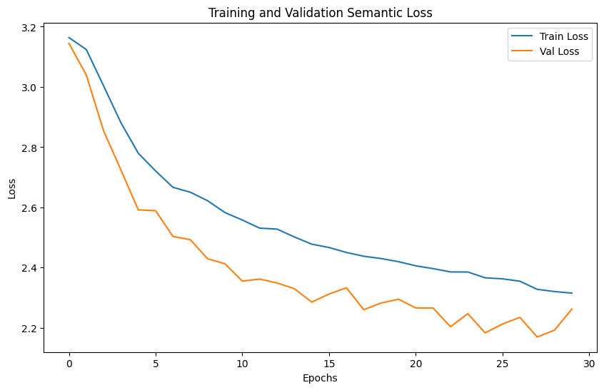
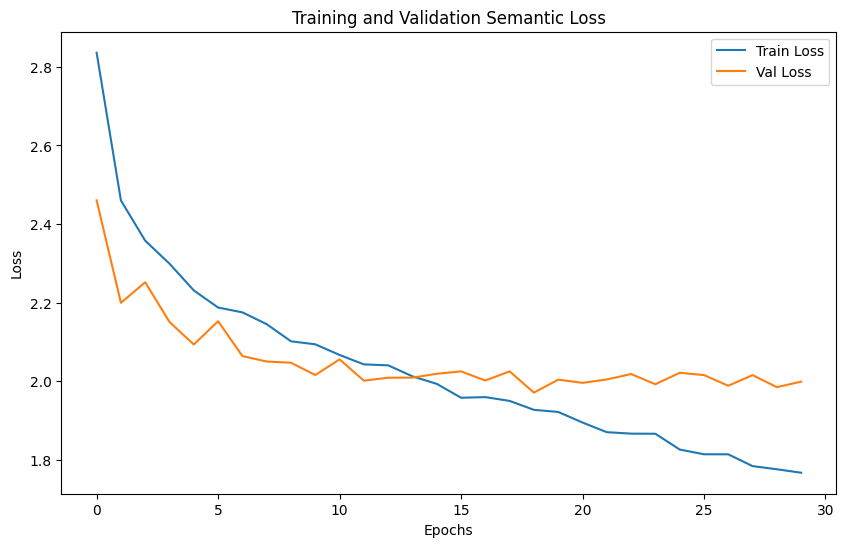
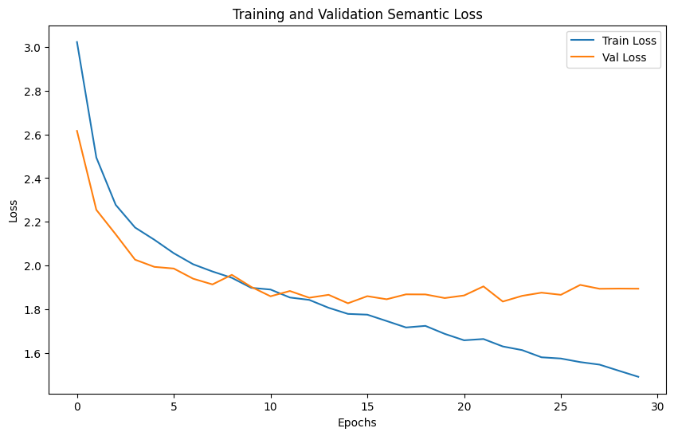

# Model
- 這個資料夾用來存放實際訓練的 CoLab 檔案
1. 比較三種不同模式下的模型下游分類任務表現(basic/with MLM/LoRA with MeSH)
2. 專有名詞(MeSH) tokenize 後的 token 長度分布
3. UMAP 查看下游任務投影表現

## 1. Downstream task - ohsumed classification
### Training/Testing data config
- 資料筆數、切割方法、seedNum、filter 等前處理設定
- 3種比較方法的分類器皆須使用相同資料集
- MLM Training/classifier Training/classifier testing

### NN classifier
- 模型頂層的分類器，訓練參數和方法都要相同
- 23種下游分類類別
```
self.classifier = nn.Sequential(
            nn.Linear(768, 1024),
            nn.LayerNorm(1024),
            nn.ReLU(),
            nn.Dropout(0.1),
            nn.Linear(1024, 512),
            nn.LayerNorm(512),
            nn.ReLU(),
            nn.Dropout(0.1),
            nn.Linear(512, 256),
            nn.LayerNorm(256),
            nn.ReLU(),
            nn.Dropout(0.1),
            nn.Linear(256, num_labels)
        )
```
### Result (base、LoRA、MLM)
#### base

```
訓練時間: 9409.17 秒

--- Final Evaluation Report ---
              precision    recall  f1-score   support

           0       0.35      0.29      0.32        42
           1       0.37      0.60      0.46        43
           2       0.51      0.56      0.53        43
           3       0.27      0.40      0.32        43
           4       0.36      0.28      0.32        43
           5       0.30      0.42      0.35        43
           6       0.25      0.60      0.35        43
           7       0.36      0.19      0.25        43
           8       0.47      0.40      0.44        42
           9       0.33      0.40      0.36        42
          10       0.56      0.56      0.56        43
          11       0.55      0.26      0.35        43
          12       0.37      0.69      0.48        42
          13       0.46      0.51      0.48        43
          14       0.28      0.21      0.24        43
          15       0.55      0.43      0.48        42
          16       0.41      0.33      0.36        43
          17       0.45      0.62      0.52        42
          18       0.34      0.33      0.33        43
          19       0.50      0.05      0.09        43
          20       0.59      0.40      0.47        43
          21       0.53      0.47      0.49        43
          22       0.50      0.02      0.04        43

    accuracy                           0.39       983
   macro avg       0.42      0.39      0.37       983
weighted avg       0.42      0.39      0.37       983
```
#### LoRA 

```
訓練時間: 9200.46 秒

--- Final Evaluation Report ---
              precision    recall  f1-score   support

           0       0.30      0.19      0.23        42
           1       0.38      0.42      0.40        43
           2       0.60      0.60      0.60        43
           3       0.31      0.21      0.25        43
           4       0.37      0.37      0.37        43
           5       0.52      0.37      0.43        43
           6       0.53      0.56      0.55        43
           7       0.31      0.42      0.36        43
           8       0.51      0.57      0.54        42
           9       0.39      0.29      0.33        42
          10       0.54      0.77      0.63        43
          11       0.47      0.44      0.46        43
          12       0.49      0.55      0.52        42
          13       0.37      0.51      0.43        43
          14       0.54      0.30      0.39        43
          15       0.45      0.67      0.54        42
          16       0.35      0.63      0.45        43
          17       0.44      0.50      0.47        42
          18       0.38      0.49      0.43        43
          19       0.30      0.19      0.23        43
          20       0.69      0.47      0.56        43
          21       0.44      0.49      0.46        43
          22       0.20      0.02      0.04        43

    accuracy                           0.44       983
   macro avg       0.43      0.44      0.42       983
weighted avg       0.43      0.44      0.42       983
```
#### MLM

```
訓練時間: 9937.83 秒

--- Final Evaluation Report ---
              precision    recall  f1-score   support

           0       0.21      0.33      0.25        42
           1       0.38      0.42      0.40        43
           2       0.64      0.58      0.61        43
           3       0.24      0.19      0.21        43
           4       0.35      0.56      0.43        43
           5       0.45      0.40      0.42        43
           6       0.46      0.37      0.41        43
           7       0.31      0.37      0.34        43
           8       0.52      0.62      0.57        42
           9       0.23      0.17      0.19        42
          10       0.69      0.72      0.70        43
          11       0.36      0.30      0.33        43
          12       0.37      0.45      0.40        42
          13       0.48      0.23      0.31        43
          14       0.39      0.44      0.41        43
          15       0.33      0.48      0.39        42
          16       0.47      0.40      0.43        43
          17       0.39      0.64      0.49        42
          18       0.42      0.42      0.42        43
          19       0.29      0.26      0.27        43
          20       0.44      0.47      0.45        43
          21       0.45      0.21      0.29        43
          22       0.00      0.00      0.00        43

    accuracy                           0.39       983
   macro avg       0.39      0.39      0.38       983
weighted avg       0.39      0.39      0.38       983
```

## 2. 專有名詞(MeSH) tokenize 後的 token 長度分布
## 3. UMAP 查看下游任務投影表現
