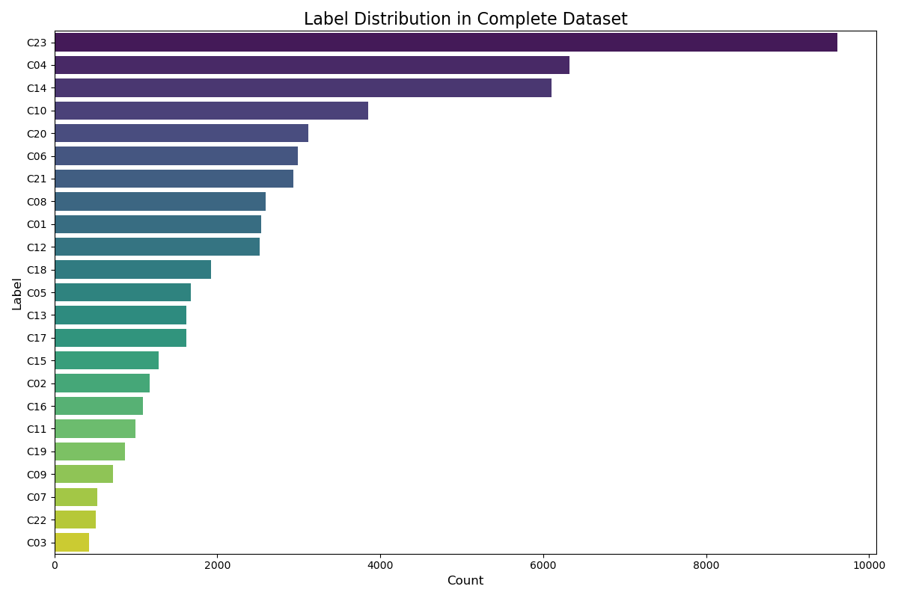
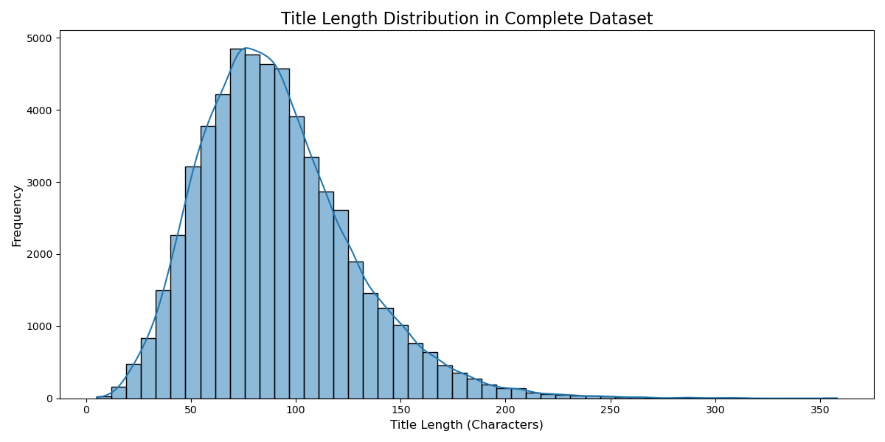
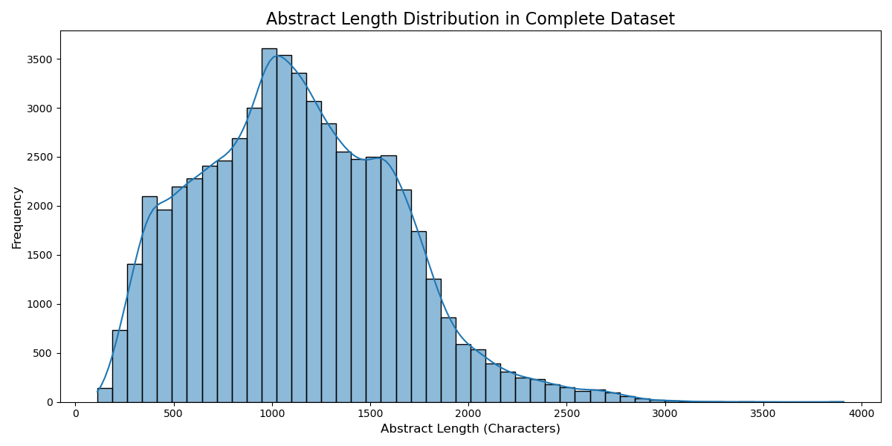

# Ohsumed 資料集分類說明

這個資料夾主要進行 Ohsumed 醫療文獻資料集建立與基本 EDA 分析。共包含兩個主要腳本：
1.  `create_dataset.py`: 用於從原始的資料夾結構中建立一個完整的 CSV 資料集。
2.  `readfile.py`: 用於讀取已生成的 CSV 檔案，並對其進行探索性資料分析 (EDA)。

---

## `create_dataset.py` 所需資料架構

`create_dataset.py` 腳本需要一個特定的資料夾結構來生成 `ohsumed_dataset.csv` 檔案。腳本會掃描其所在的目錄，尋找代表不同**類別 (Label)** 的子資料夾。

### 架構要求：

-   每一個類別都必須是一個**獨立的子資料夾**。
-   腳本預設會尋找名稱以 `C` 開頭的資料夾 (例如 `C01`, `C02`, `C23` 等)。
-   每個子資料夾內的**每一個檔案**都應包含一篇醫療文獻的**原始文本 (Text)**。

### 示範結構：

執行 `create_dataset.py` 之前，您的資料夾結構應如下所示：

```
.
├── C01/
│   ├── 1.txt
│   ├── 2.txt
│   └── ...
├── C04/
│   ├── 101.txt
│   ├── 102.txt
│   └── ...
├── C23/
│   ├── 250.txt
│   ├── 251.txt
│   └── ...
├── create_dataset.py
└── readfile.py
```

執行後，腳本會生成一個名為 `ohsumed_dataset.csv` 的檔案。腳本會將每個檔案的第一行作為 `title`，其餘內容作為 `abstract`。其內容格式如下：

| title                      | abstract                  | label |
| -------------------------- | ------------------------- | ----- |
| (檔案 `C01/1.txt` 的第一行) | (檔案 `C01/1.txt` 的剩餘內容) | C01   |
| (檔案 `C04/101.txt` 的第一行)| (檔案 `C04/101.txt` 的剩餘內容)| C04   |
| ...                        | ...                       | ...   |

---

## 探索性資料分析 (EDA)
- Total number of `ohsumed_dataset.csv` records: 56984
- `readfile.py` 腳本會讀取 `ohsumed_dataset.csv` 並針對 `label`, `title`, 和 `abstract` 三個欄位進行獨立分析，生成以下關於資料集分佈的圖表。

### 標籤分佈 (Label Distribution)

下圖顯示了資料集中各個類別（標籤）的樣本數量分佈。可以看出不同類別的樣本數存在不平衡的狀況。



### 標題長度分佈 (Title Length Distribution)

下圖顯示了資料集中所有**標題**的字元長度分佈狀況。



### 摘要長度分佈 (Abstract Length Distribution)

下圖顯示了資料集中所有**摘要**的字元長度分佈狀況。


